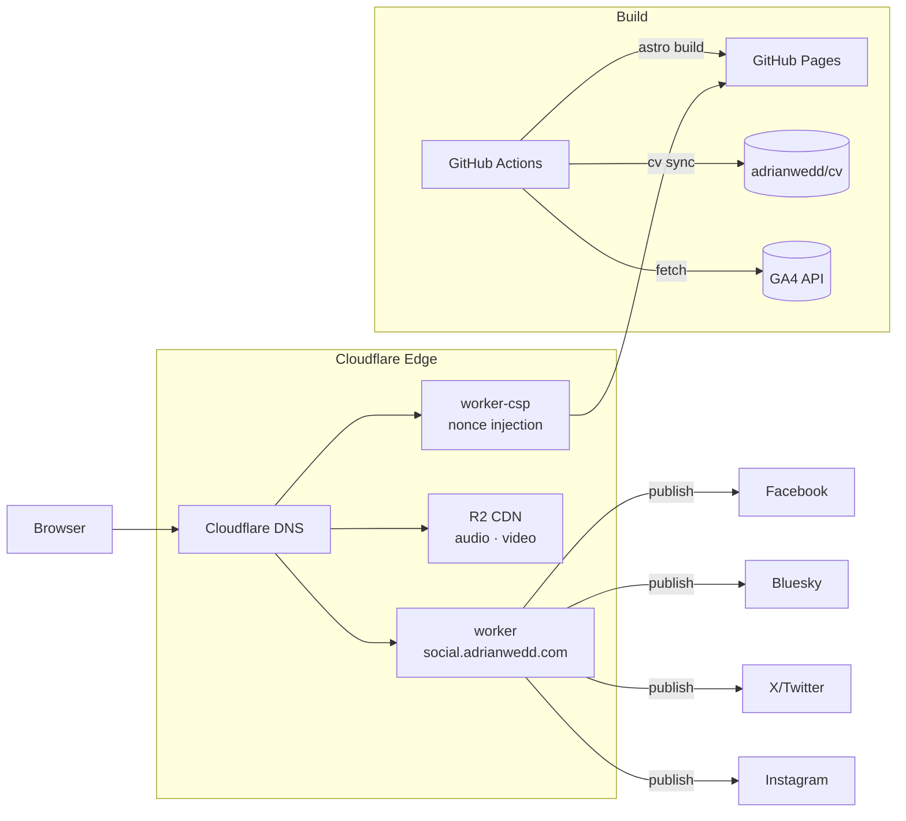

# adrianwedd.com

[](https://github.com/adrianwedd/adrianwedd.com/actions/workflows/deploy.yml)
[](https://github.com/adrianwedd/adrianwedd.com/actions/workflows/lighthouse.yml)
[](https://github.com/adrianwedd/adrianwedd.com/actions/workflows/content-pipeline.yml)

Personal website of Adrian Wedd. Astro 6 on GitHub Pages. Dark-first design with a botanical earth-tone palette — plum-tinted darks, dusty copper accent.

## Table of Contents

- [Quick Start](#quick-start)
- [Stack](#stack)
- [Architecture](#architecture)
  - [Theming](#theming)
  - [View Transitions](#view-transitions)
  - [Islands](#islands-13-preact-components)
  - [Content Collections](#content-collections)
  - [Permalink Strategy](#permalink-strategy)
  - [Schema.org JSON-LD](#schemaorg-json-ld)
  - [OG Image Dimensions](#og-image-dimensions)
  - [Deployment Topology](#deployment-topology)
- [Quality Gates](#quality-gates)
- [Social Media Worker](#social-media-worker)
- [NotebookLM Automation](#notebooklm-automation)
- [CI/CD Pipeline](#cicd-pipeline)
- [Scripts](#scripts)
- [Key Patterns](#key-patterns)
- [Design](#design)
- [Documentation](#documentation)

## Quick Start

**Prerequisites:** Node 22, npm.

```bash
npm install
npm run dev            # dev server at localhost:4321
npm run build          # production build (Astro + Pagefind indexing)
npm run preview        # preview production build
npm run check          # type check + lint + content validation
npm run lint           # ESLint only
npm run format         # Prettier (write)
npm run format:check   # Prettier (check only)
npm run test:worker    # social worker tests
npm run test:csp       # CSP worker tests + typecheck
```

The site builds without `src/data/base-cv.json` (CV data is synced from a private repo at deploy time; local dev falls back to defaults). See `.env.example` for the environment variables needed for GA4 and social posting.

Content validation: `npm run validate` (required fields, descriptions ≤160 chars, heroImage paths).

## Stack

| Layer              | Technology                                                                   |
| ------------------ | ---------------------------------------------------------------------------- |
| **Framework**      | Astro 6, TypeScript strict, fully static output                              |
| **Styling**        | Tailwind CSS 4 with CSS custom properties for dark/light theming             |
| **Islands**        | Preact for 13 interactive components                                         |
| **Content**        | Astro Content Collections — blog, projects, gallery, audio                   |
| **Search**         | Pagefind (client-side WASM, indexed at build time)                           |
| **Analytics**      | GA4 + LinkedIn Insight Tag, consent-gated                                    |
| **Hosting**        | GitHub Pages via GitHub Actions                                              |
| **DNS**            | Cloudflare                                                                   |
| **Media CDN**      | Cloudflare R2 at `cdn.adrianwedd.com` (audio + video)                        |
| **Social worker**  | Cloudflare Worker at `social.adrianwedd.com` — cross-platform social posting |
| **CSP worker**     | Cloudflare Worker in `worker-csp/` — per-request nonce injection at the edge |

## Architecture

### Theming

CSS custom properties in `src/styles/global.css` define all colours (`:root` = dark, `.light` = light). Tailwind 4 maps them via the `@theme` block in that same file — there is no `tailwind.config.mjs`. An inline script in `BaseLayout.astro` reads `localStorage('theme')` before paint to prevent flash.

**Never use Tailwind's `dark:` prefix** — theming is driven by CSS custom properties, not Tailwind dark mode classes.

### View Transitions

All interactive scripts follow this pattern to survive Astro View Transitions:

- `is:inline` (not module `<script>`) so scripts re-execute on VT swap
- Sentinel on `documentElement.dataset` to prevent duplicate global listeners
- Event delegation on `document` since DOM elements get replaced on swap
- Lazy DOM lookups via functions (not cached references)
- `astro:after-swap` listener registered inside the sentinel guard

### Islands (13 Preact components)

Client-hydrated interactive components in `src/components/islands/`:

| Island             | Purpose                                        |
| ------------------ | ---------------------------------------------- |
| AudioPlayer        | Audio playback for blog/project overviews      |
| Personalisation    | Dynamic content personalisation                |
| Transparency       | AI transparency disclosures                    |
| Flashcards         | Study cards from NotebookLM                    |
| Quiz               | Quiz questions from NotebookLM                 |
| MindMap            | Mind map diagrams                              |
| DataTable          | Interactive data tables                        |
| TableOfContents    | Scrolling ToC with active-section highlighting |
| ActivityDashboard  | GitHub activity visualisation                  |
| GitHubActivity     | GitHub contribution data                       |
| AnalyticsDashboard | GA4 analytics display                          |
| ShareButton        | Social sharing                                 |
| TerminalEasterEgg  | Hidden terminal emulator                       |

All other components are Astro (server-rendered, zero JS).

### Content Collections

Defined in `src/content.config.ts`. The site currently has 79 blog posts, 35 projects, 102 audio episodes, and 7 gallery collections.

| Collection   | Key fields                                                                                                                                                                                           |
| ------------ | ---------------------------------------------------------------------------------------------------------------------------------------------------------------------------------------------------- |
| **blog**     | title, description, date, tags, draft, heroImage, `faq` (optional `[{q,a}]` → FAQ schema), `series`/`seriesOrder`, plus optional media fields: `audioUrl`, `videoUrl`, `youtubeUrl`, `infographic`, `mindmap`, `quiz`, `flashcards`, `dataTable`, `slides` |
| **projects** | title, description, date, tags, status (`active\|complete\|archived\|experiment`), featured, url, repo, heroImage, `series`/`seriesOrder`, plus the same optional media fields as blog                |
| **gallery**  | title, date, tags, images array (`{src, alt, caption?}`), medium, collection, coverImage                                                                                                             |
| **audio**    | title, description, date, tags, `audioUrl` or `videoUrl` (one required by validation), `duration`, transcript, heroImage, `relatedProject`, `relatedPost`                                           |

The media fields (`audioUrl`, `videoUrl`, `youtubeUrl`, `infographic`, etc.) are defined as a shared Zod object spread directly into each schema — they appear as top-level frontmatter fields, not as a nested object.

### Permalink Strategy

URLs are permanent. Once published, a page's URL must not change.

- **Blog:** `/blog/{slug}/`
- **Projects:** `/projects/{slug}/`
- **Gallery:** `/gallery/{slug}/`, images at `/gallery/{collection}/{image-slug}/`
- **Audio:** `/audio/{slug}/`

`updatedDate` in frontmatter tracks content revisions without changing URLs. Slug is derived from filename, always stripped of the `.md` extension via `slug()` from `src/lib/utils.ts`.

### Schema.org JSON-LD

- `about.astro` — Person schema (from `src/data/base-cv.json`)
- `projects/[...slug].astro` — SoftwareApplication + conditional VideoObject
- `blog/[...slug].astro` — Article + conditional VideoObject + conditional FAQPage
- `services.astro` — ProfessionalService
- `Breadcrumb.astro` — BreadcrumbList on all detail pages

### OG Image Dimensions

`og:image:width`/`og:image:height` are read from the actual file at build time via `src/lib/image-dimensions.ts` — a 256 KB header parser for PNG/JPEG/WebP/GIF. Every `.webp` heroImage also needs a `.jpg` twin at the same path; the OG twin CI gate enforces this.

### Deployment Topology



## Quality Gates

Every PR and deploy passes the full suite:

| Gate | Command | Notes |
|------|---------|-------|
| Type check | `npx astro check` | Strict TypeScript across all `.astro` and `.ts` files |
| Lint | `npm run lint` | ESLint with Astro + TypeScript rules |
| Content validation | `npm run validate` | Required fields, descriptions ≤160 chars, heroImage paths |
| Build | `npm run build` | Astro + Pagefind indexing must succeed cleanly |
| Image policy | CI gate | No raw `` on local paths — must use `<Picture>` from `astro:assets` |
| OG twins | CI gate | Every `.webp` heroImage must have a `.jpg` twin |
| Build size budget | CI gate | `dist/_astro/` ≤ 100MB; warns on JS chunks >150KB |
| Internal links | `npm run check:links` | Scans built HTML for same-origin 404s |
| External links | Lychee | Config in `.lychee.toml` |
| Lighthouse | `lighthouse.yml` | 90% threshold on 7 pages (PR-only) |
| Worker tests | `npm run test:worker` | Vitest with per-platform mock registry |
| CSP worker | `npm run test:csp` | Tests + `tsc --noEmit` |

Run `npm run check` locally to cover the first three in one step.

## Social Media Worker

Cloudflare Worker (`worker/`) at `social.adrianwedd.com` manages cross-platform social posting.

**Platforms:** Facebook, Instagram, Bluesky, X/Twitter.

**Features:**

- Content pushes to `main` sync the date-scheduled queue; posts broadcast when their frontmatter `date` arrives (not immediately on merge)
- Scheduled and ad-hoc post queue (JSON seed in `social/`, KV for state)
- Comment monitoring with crisis detection, classification, and auto-reply
- Backdated posting to match original publication dates
- Idempotency via stable keys (`forceRetry: true` bypasses failed records but never published ones)
- Atomic cron locking via Durable Object (`CronLock`) with fencing tokens — prevents concurrent cron tick races

**Worker endpoints:**

- `POST /api/publish` — immediate publish (`platform` ∈ `facebook|instagram|bluesky|twitter`). Returns `409` if another publish for the same `idempotencyKey` is in flight.
- `POST /api/queue` + `POST /api/queue/sync` — scheduled queue
- `POST /api/cron/publish` — hourly publish from queue (DO-locked)
- `POST /api/cron/comments` — comment monitor, 2-hourly (DO-locked)
- `GET /api/health` — token health and queue status

**Social CLI:**

```bash
scripts/fb-post.sh "Post text"                          # immediate post
scripts/fb-post.sh "Post text" --link URL               # link post
scripts/fb-post.sh "Post text" --backdate 2026-01-15    # backdated
scripts/fb-post.sh "Post text" --schedule 2026-04-01    # scheduled
scripts/fb-post.sh --health                             # token + queue status
scripts/fb-post.sh --sync                               # sync queue JSON to KV
```

## NotebookLM Automation

Automated generation of audio overviews, video summaries, infographics, and other Studio assets for blog and project pages. Scripts in `scripts/notebooklm/`.

**Quick start:**

```bash
cd scripts/notebooklm
nlm login                                                       # authenticate (one-time)
./scripts/automate-notebook.sh --config config.json --parallel  # generate assets
```

**Asset types:** audio (~2-10 min generation), video (~2-10 min), infographic, mindmap, quiz, flashcards, data-table, report, slides.

**Media pipeline:**

1. Generate assets via NotebookLM
2. Copy audio as-is — **never transcode or compress** (NLM delivers 256kbps stereo AAC; serve it at original quality)
3. Upload audio + video to R2 (`cdn.adrianwedd.com`)
4. Keep infographics in `public/notebook-assets/` (committed to git)
5. Update frontmatter with CDN URLs (audio/video) and local paths (infographic)

**Batch generation:** `scripts/generate-all-notebook-assets.sh` (audio), `scripts/generate-all-infographics.sh` (images), `scripts/retry-failed-infographics.sh` (retry after rate limits). Daily quota: ~50 generations per asset type.

See `docs/NOTEBOOKLM_PIPELINE.md` for the full pipeline reference.

## CI/CD Pipeline

### Deploy (`deploy.yml`) — triggers on push to `main`

1. `npm ci` → `npx astro check` → lint → validate content → audit deps → fetch GA4 analytics
2. Checkout CV data from `adrianwedd/cv` → copy to `src/data/base-cv.json`
3. `npm run build` (Astro + OG image generation + Pagefind)
4. Enforce no raw `` on local paths
5. Enforce `.jpg` OG twin for every `.webp` heroImage
6. Build size budget check (`dist/_astro/` ≤ 100MB; warn on JS chunks >150KB)
7. `scripts/test-site.sh` — smoke tests on built output
8. Lychee external link check — config in `.lychee.toml`
9. Internal-link check (`npm run check:links`)
10. Upload pages artifact + deploy to GitHub Pages
11. **Parallel job:** `worker-csp` — `npm test` + `tsc --noEmit`

### Other Workflows

| Workflow                 | Trigger                   | Purpose                                                       |
| ------------------------ | ------------------------- | ------------------------------------------------------------- |
| `lighthouse.yml`         | PR checks                 | Lighthouse on 7 pages (90% thresholds) + `astro check`       |
| `social-autopublish.yml` | Push to `main`            | Sync date-scheduled queue to KV; worker cron fires on `date`  |
| `social-cron.yml`        | Hourly + 2-hourly         | Publish from queue + comment monitor                          |
| `content-pipeline.yml`   | Weekly (Sunday 22:00 UTC) | Discover academic papers, create draft blog PRs               |

## Scripts

### Content Authoring

```bash
scripts/new-post.sh "Title"       # scaffold blog post
scripts/new-project.sh "Title"    # scaffold project page
scripts/import-gallery.sh dir/    # import image directory as gallery
scripts/import-audio.sh file.mp3  # import audio episode
```

### Validation & Generation

- `scripts/validate-content.js` — required fields, descriptions ≤160 chars, heroImage paths
- `scripts/generate-og-images.mjs` — 1200×630 OG PNGs for posts without a heroImage (skips existing)
- `scripts/fetch-ga4-data.mjs` — pull analytics from GA4 service account (CI step)
- `scripts/extract-frontmatter.mjs` — extract YAML frontmatter as JSON (used by autopublish)
- `scripts/check-internal-links.mjs` — scan built HTML for same-origin 404s

### Media & CDN

- `scripts/upload-media-to-r2.sh` — upload audio/video to Cloudflare R2
- `scripts/optimise-images.sh` — compress images
- `scripts/migrate-to-r2.sh` — migrate assets from git to R2

### NotebookLM

- `scripts/generate-all-notebook-assets.sh` — batch audio generation for all projects
- `scripts/generate-all-infographics.sh` — batch infographic generation
- `scripts/retry-failed-infographics.sh` — retry after rate limits
- `scripts/regenerate-branded-infographics.sh` — regenerate with consistent branded style

## Key Patterns

- **Slug utility:** Collection IDs include `.md` extension — always strip with `slug()` from `src/lib/utils.ts`
- **OG twins:** Every `.webp` heroImage needs a `.jpg` twin at the same path — CI enforces this
- **No custom fonts:** System font stack only — zero font downloads
- **Consent-first:** No tracking before user consent. Use `dns-prefetch` (not `preconnect`) for GA4 origins
- **Images:** Use `<Picture>` from `astro:assets` for all local images — CI gate enforces this
- **CV sync:** `src/data/base-cv.json` is gitignored, synced from `adrianwedd/cv` at build time; local dev falls back to defaults
- **Class-based selectors:** ThemeToggle and Header use class selectors (not IDs) to avoid duplicate ID bugs across desktop/mobile nav
- **Audio quality:** Never compress or re-encode published audio — serve original-quality `.m4a` at the CDN URL

## Design

- Botanical earth-tone palette: plum-tinted darks, dusty copper accent (`#c48b6e`), mauve-gray muted tones
- Light mode: warm cream backgrounds, umber accent (`#8a5e42` for WCAG AA)
- System fonts only — zero font downloads
- WCAG 2.1 AA compliant
- Consent-first: no tracking before user consent
- `prefers-reduced-motion` and `prefers-contrast` respected
- Mobile-first responsive

## Documentation

- `CLAUDE.md` — AI agent instructions and full codebase reference
- `CHANGELOG.md` — narrative project changelog
- `CONTRIBUTING.md` — setup, conventions, PR checklist
- `SECURITY.md` — responsible disclosure policy
- `docs/NOTEBOOKLM_PIPELINE.md` — NotebookLM content pipeline reference
- `docs/PROJECT_SPEC.md` — Technical specification
- `docs/DESIGN_CHARTER.md` — Design charter
- `docs/ROADMAP.md` — Feature roadmap

## QA Tools

Three-way QA with Codex, Agy, and Hermes in parallel:

```bash
codex exec --full-auto "QA prompt" 2>&1 | tee /tmp/codex-qa.txt &
agy -p "QA prompt" --dangerously-skip-permissions 2>&1 | tee /tmp/agy-qa.txt &
hermes chat -q "QA prompt" -Q 2>&1 | tee /tmp/hermes-qa.txt &
wait
```

Codex is strongest on security + correctness. Agy on design + accessibility. Hermes on research + cross-referencing.
